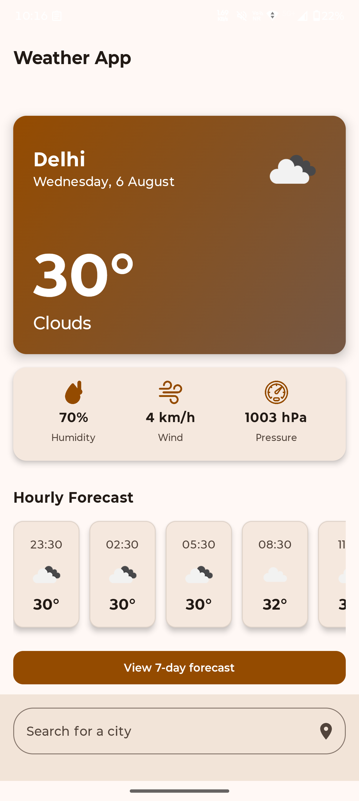
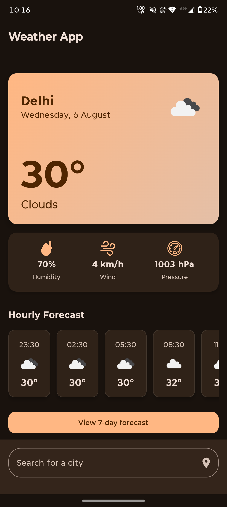
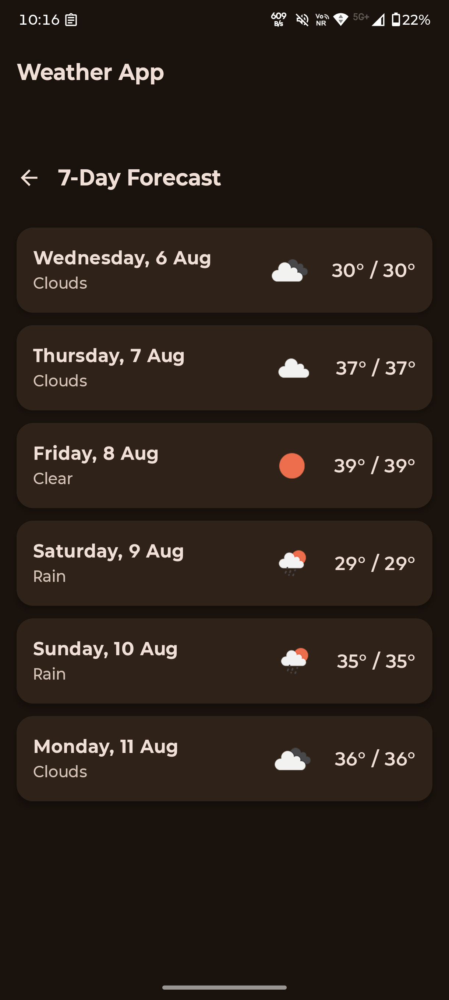

# 🌦️ Weather App — A Modern Android Application

A beautifully designed, **feature-rich weather application** built with 100% Kotlin and the latest Android development tools. It provides **real-time weather data**, **hourly and daily forecasts**, and a **dynamic, animated user interface** that supports both Light and Dark modes.

<div align="center">
  
  
  
</div>

---

## ✨ Features

✅ **Real-Time Weather Data**  
Get live temperature, conditions, humidity, wind speed, and pressure for any city in the world.

✅ **Dynamic UI with Smooth Animations**  
Fluid transitions for loading, error, and data states enhance user experience.

✅ **Location-Based Weather**  
Utilizes GPS to fetch weather for your current location with a single tap.

✅ **7-Day Forecast**  
A detailed week-long forecast screen with daily breakdowns.

✅ **Persistent Search Memory**  
Automatically loads the last searched city at startup.

✅ **Adaptive Theming**  
Stunning custom theme with Light and Dark mode support, adapting to system settings.

---

## 🛠️ Tech Stack & Architecture

### 🧩 UI

| Technology           | Description                                                                 |
|----------------------|-----------------------------------------------------------------------------|
| **Jetpack Compose**  | Modern, declarative UI toolkit for building native UIs                      |
| **Material Design 3**| Implements Google's latest design system for a polished look                |
| **Compose Animation**| Smooth and elegant animations for transitions and state changes             |

### 🏗️ Architecture

| Component             | Description                                                                 |
|-----------------------|-----------------------------------------------------------------------------|
| **MVVM**              | Clean separation between UI, business logic, and data                       |
| **Repository Pattern**| Centralized data management and abstraction                                 |
| **Manual DI (AppContainer)** | Lightweight, testable dependency injection                         |

### 🔧 Core Libraries

| Library                | Purpose                                                                     |
|------------------------|-----------------------------------------------------------------------------|
| **Kotlin**             | Entire codebase written in modern, expressive Kotlin                       |
| **Coroutines & StateFlow** | Efficient asynchronous and reactive state handling                   |
| **Retrofit & OkHttp**  | Networking with the OpenWeatherMap API                                     |
| **Jetpack Navigation** | Declarative and type-safe in-app navigation                                |
| **Jetpack DataStore**  | Persistent, asynchronous storage of preferences                            |
| **Coil**               | Fast and easy image loading (e.g., weather icons)                          |

---

## 📸 Screenshots

```md
<!-- Add your actual image paths in the "src" below -->
<div align="center">
  
  
  
</div>
